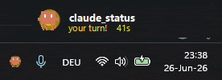
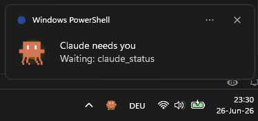

# Claude Code Status Robot 🤖

**You fire off a prompt, tab away to do real work… and forget Claude is sitting there waiting for you.**

Five minutes later you check back — it stalled on a permission prompt the whole time. Or you've got
*three* Claude Code sessions running across three projects and you have no idea which one needs you,
which one's still grinding, and which one finished ten minutes ago.

There's no light. No sound. No glance-able "is it my turn yet?" Just you, alt-tabbing back and forth,
babysitting a terminal.

**Meet your status robot.** 🤖



A tiny animated pixel robot lives in your system tray and tells you — at a glance, across *every* session —
exactly what Claude is doing:

- 🟠 **Working?** It marches and breathes amber.
- 🟡 **Needs you?** It strobes yellow, shakes, chirps in a cute robot voice, and pops a toast.
- 🔵 **Done / idle?** It dozes off with a slow blue blink.

Pop out the floating widget and you get **one robot per session** — sorted so whoever needs you is on top.
Never babysit a terminal again.



> No hardware. No Python. No accounts. Nothing to install beyond what's already on Windows —
> just hooks, a state file, and one PowerShell script.

## 60-second install

```powershell
git clone https://github.com/hamzafarooqarif/claude-status-robot.git
cd claude-status-robot
powershell -ExecutionPolicy Bypass -File install.ps1 -StartAtLogin
```

That's it. `install.ps1` wires up the Claude Code hooks, unblocks the files, and creates a
`Claude Status.lnk` shortcut — `-StartAtLogin` also drops it in your Startup folder so the robot
is there every time you log in. Open `/hooks` in Claude Code once (or restart it) so the new hooks
load, and the robot starts reporting. Changed your mind? `uninstall.ps1` removes everything.

## How it works

```
Claude Code hooks  ->  state file on disk  ->  cc_status.ps1  ->  tray icon + widget
   (settings.json)     (the contract)          (PowerShell/WinForms)
```

- **Hooks** in your user `settings.json` write a word (`BUSY`/`WAIT`/`IDLE`) to a state
  file on every relevant event. They run a tiny `.cmd` and are `async` so they never
  block Claude.
- **Per-session state files:** `%USERPROFILE%\.claude\cc_status\sessions\*.txt` — one per
  project, each holding `STATE|project-dir`.
- **`cc_status.ps1`** polls those files. The **tray icon** shows the *aggregate* (WAIT if any
  session waits → BUSY if any works → else IDLE). Right-click it → **Show/Hide widget** for the
  **per-session list** — one mini-robot row per project (`project · state · how long waiting`),
  sorted with whoever needs you first.

## Files

| File | Purpose |
| ---- | ------- |
| `cc_status.ps1` | The app: animated tray robot + toggleable floating widget. |
| `start_status.cmd` / `Claude Status.lnk` | Launch it hidden (double-click the shortcut). |
| `hooks\set_state.cmd` | Writes a state word to the state file (called by the hooks). |
| `assets\voices\*.wav` | Synthesized "EMO robot" voices for the WAIT alert. |
| `assets\make_voices.ps1` | Regenerates the voice WAVs (tweak notes / `$Transpose`). |
| `assets\robot.ico` | The shortcut's icon. |
| `watch_state.ps1` | Debug tool: live-prints the state file. |

## Run it

Double-click **`Claude Status.lnk`** (or `start_status.cmd`). The robot appears in the
tray; the widget shows automatically. Right-click either to Hide/Exit.

Start at login: copy `Claude Status.lnk` into your Startup folder
(`Win+R` → `shell:startup`).

## The hooks (Layer 1)

These are added to `%USERPROFILE%\.claude\settings.json` (backed up to `settings.json.bak`):

| Event | Matcher | Writes |
| ----- | ------- | ------ |
| `UserPromptSubmit`, `PreToolUse`, `PostToolUse` | — | `BUSY` |
| `PermissionRequest`, `Notification` | `permission_prompt` | `WAIT` |
| `Stop` | — | `IDLE` |
| `SessionEnd` | — | removes that session's file |

Each hook writes a file keyed by `CLAUDE_PROJECT_DIR`, so concurrent sessions in different
projects each get their own row (and the hook stays a fast async `.cmd` — no JSON parsing).

> If hooks don't fire after editing `settings.json`, open `/hooks` once (reloads them)
> or restart Claude Code.

Test the pipeline without Claude — watch the session list react to manual writes:
```powershell
powershell -ExecutionPolicy Bypass -File watch_state.ps1     # one terminal: live session list
hooks\set_state.cmd BUSY     # another terminal: writes a session for the current folder
```

## Settings (no editing needed)

Right-click the tray robot → **Settings…** to change, with a friendly dialog:
sound on/off, toast on/off, show-widget-on-start, the **waiting voice** (with a **Test**
button), and the idle-fallback seconds. Saved to `%USERPROFILE%\.claude\cc_status\config.json`
and applied immediately — survives restarts. Delete that file to reset to defaults.

## Advanced (top of `cc_status.ps1`)

The defaults below are overridden by `config.json`. Edit these only for things the
Settings dialog doesn't cover:

- `$ShowWidgetOnStart` — show the floating widget at launch (default on).
- `$WaitWav` — the WAIT sound (currently `assets\voices\excited.wav`). Run
  `assets\make_voices.ps1` to (re)generate the full voice set — `excited`, `emo`, `happy`,
  `walle`, `curious`, `chirpy` — then point `$WaitWav` at whichever you like, or your own `.wav`.
- `$SoundOnWait` / `$ToastOnWait` — toggle the chime / toast.
- `$label` — the playful words (`on it!` / `your turn!` / `zzz`).
- `$Cell` — robot size. `$FrameMs` — animation speed.
- `$BusyTimeoutSec` — after this many seconds of no state change while `BUSY`, fall back
  to `IDLE`. Safety net for Esc-interrupts (Claude Code fires no hook on interrupt). `0`
  disables it.

Regenerate / re-pitch the voices: edit `assets\make_voices.ps1` (notes and `$Transpose`,
where `1.0` = original pitch, `0.5` = an octave down) and re-run it.

## State reference

| State  | Meaning                              | Robot                                   |
| ------ | ------------------------------------ | --------------------------------------- |
| `BUSY` | Claude is working                    | amber, marching legs, breathing glow    |
| `WAIT` | Claude is waiting for your input     | yellow, strobing + shaking + robot voice|
| `IDLE` | Claude is done / idle                | dim blue, resting (slow blink)          |

## Known limitations

- **Windows-only** (uses .NET WinForms). The hooks + state file are portable; the robot UI is not.
- **No interrupt hook:** pressing Esc fires no hook. By default (`$BusyTimeoutSec = 0`) `BUSY` stays until
  Claude finishes normally (its `Stop` hook → `IDLE`), so long tasks never wrongly go idle — but after an Esc
  interrupt the robot stays "working" until your next prompt. Set the Settings "go idle after" value > 0 to
  auto-clear after N seconds instead (the old behavior).
- **Multiple sessions** are tracked per *project directory*: sessions in different projects each
  get their own row; two sessions in the **same** project share one entry (last writer wins).
- A compiled `.exe` version was dropped because antivirus quarantines unsigned self-built binaries;
  the app runs via Windows' signed `powershell.exe` instead.
